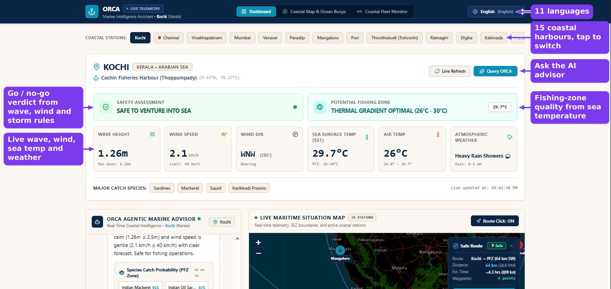
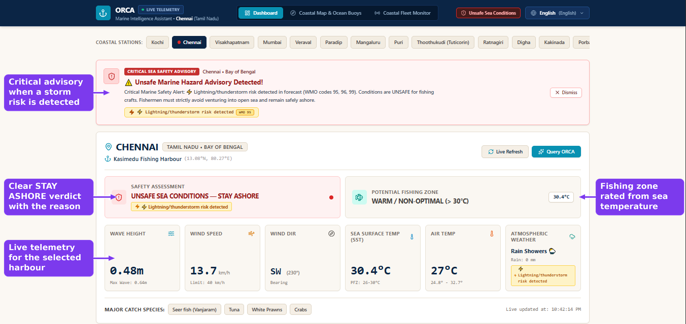
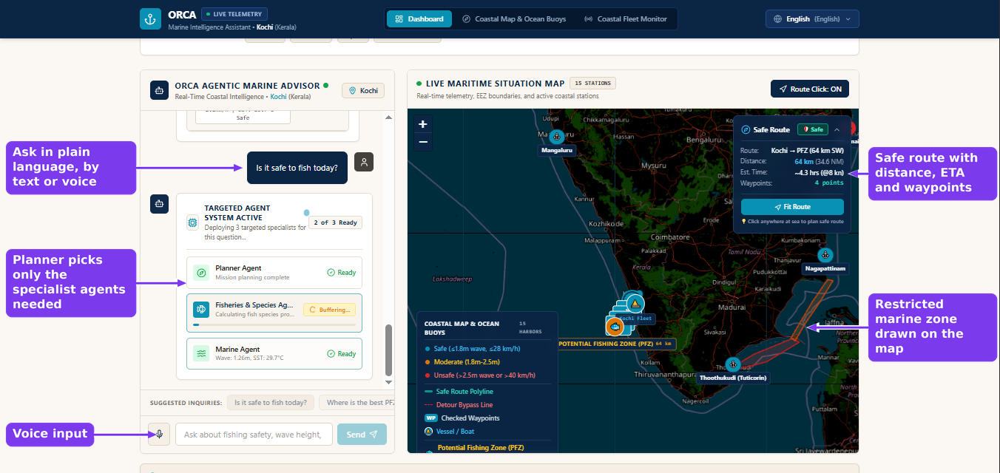
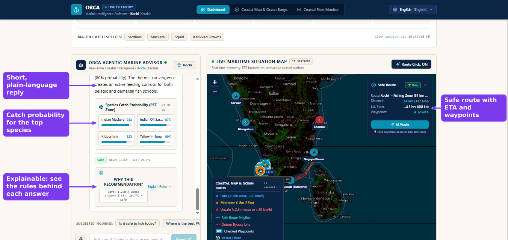
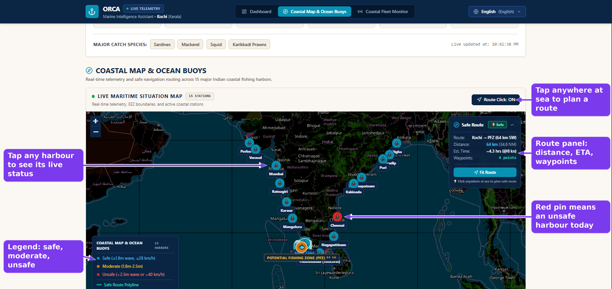
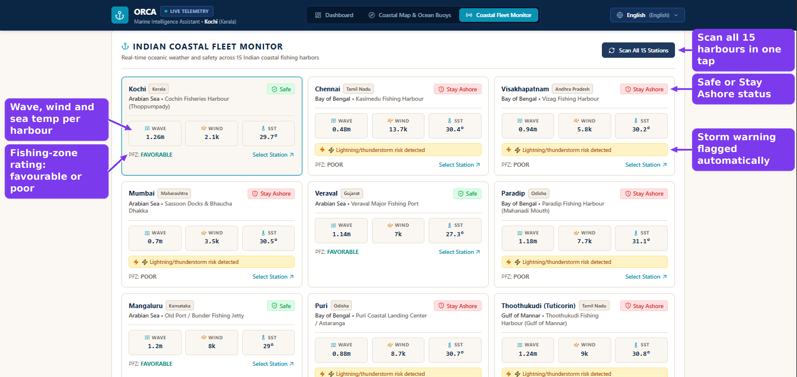
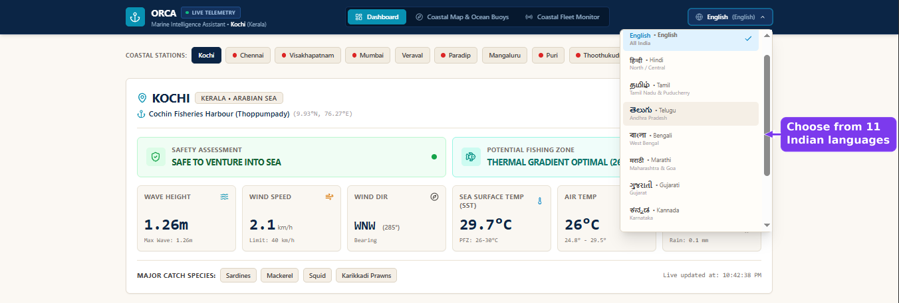

# ORCA — Marine Intelligence Assistant

**Team AQUA-AGENTS** · Smart India Hackathon 2026 · Problem Statement **SIH26176**

**Live demo:** <https://orca-marine-psi.vercel.app/>

ORCA is a multi-agent AI assistant built for Indian fishermen and coastal communities.
It combines live marine and weather data with a set of specialist agents to answer one
practical question: **"Is it safe to go out today, and where should I fish?"**

Answers come with the data behind them (wave height, wind, sea temperature, zone
checks), and the whole interface works in **11 Indian languages**.



*Dashboard: live safety verdict, fishing-zone quality and telemetry for the selected harbour.*

## Smart India Hackathon 2026

| Field              | Details                                                  |
| ------------------ | -------------------------------------------------------- |
| Problem Statement  | SIH26176                                                 |
| Title              | ORCA Marine EcOsystem Reasoning with Collaborative Agents |
| Organization       | Indian Space Research Organisation (ISRO)                |
| Category           | Software                                                 |
| Team               | AQUA-AGENTS                                              |

## Problem

Small-scale fishermen make daily go / no-go decisions using scattered forecasts,
often in English, with no easy way to check restricted waters such as marine
sanctuaries or the India–Sri Lanka maritime boundary. A wrong call can cost a boat,
a catch, or a life. ORCA puts weather, sea state, fishing-zone hints and boundary
alerts into one conversational, multilingual interface.

## Features

- **Multi-agent pipeline**: a planner routes each question to specialist agents
  (Weather, Marine, Fisheries & PFZ, Geofence Guardian, Route & Navigation,
  Risk & Safety) and a Fleet Coordinator combines their output.
- **Live data** from the Open-Meteo Weather and Marine APIs (wind, precipitation,
  wave height and direction, sea-surface temperature, daily forecast).
- **Sea-safety verdict** using explicit rules: waves above 2.5 m, wind above
  40 km/h, or a thunderstorm forecast (WMO codes 95, 96, 99) mark conditions unsafe.
- **Potential Fishing Zone (PFZ) guidance** based on sea-surface temperature
  (favourable range 26–30 °C) plus likely species and catch probability.
- **Geofence alerts** for four restricted areas: Gulf of Mannar Marine National Park,
  the India–Sri Lanka IMBL buffer, Gahirmatha Marine Sanctuary and Gulf of Kutch
  Marine Park.
- **Safe-route suggestions** that check waypoints against restricted zones and
  weather limits and propose a detour when needed.
- **Interactive coastal map** (Leaflet) and a **fleet monitor** that scans all 15
  coastal stations at once.
- **Explainability**: every answer shows the reasoning trace, tools called and rules
  applied.
- **Voice input** through the browser Speech Recognition API.
- **Resilient by design**: if Gemini is unavailable or rate-limited, a local agent
  engine still produces a complete answer from the same live data.

## Screenshots

### Unsafe-condition advisory
When a storm or rough sea is detected, ORCA raises a critical advisory and tells the fisherman to stay ashore.



### Multi-agent AI advisor
A planner agent decides which specialist agents (weather, marine, fisheries, geofence, route, risk) are needed for each question.



### Explainable answers
Replies include species catch probability and a "Why this recommendation?" panel showing the rules applied.



### Coastal map and safe routes
Live map of all 15 harbours with colour-coded safety, restricted zones, fishing zones and click-to-plan safe routes.



### Coastal fleet monitor
Scan every harbour at once and compare wave, wind, sea temperature, storm warnings and fishing-zone ratings.



### Multilingual interface
The interface is available in 11 Indian languages.



Live demo: <https://orca-marine-psi.vercel.app/>

## Tech stack

| Layer      | Technology                                             |
| ---------- | ------------------------------------------------------ |
| Frontend   | React 19, TypeScript, Vite, Tailwind CSS 4, Leaflet    |
| Backend    | Node.js, Express, TypeScript (run with `tsx`)          |
| AI         | Google Gemini via `@google/genai` (natural-language replies) |
| Data       | Open-Meteo Weather API, Open-Meteo Marine API          |

## Project structure

```
orca-marine-intelligence-assistant/
├── server/
│   └── index.ts              # Express server, /api/chat (Gemini), /api/health
├── src/
│   ├── components/
│   │   ├── chat/             # chat UI, reasoning trace, explainability panel
│   │   ├── dashboard/        # location card, fleet monitor, alerts, skeletons
│   │   ├── map/              # Leaflet coastal map
│   │   └── layout/           # header and language switcher
│   ├── services/
│   │   ├── agents/           # agent engine and lead-agent detection
│   │   └── marine/           # Open-Meteo calls, safety rules, routing, geography
│   ├── data/                 # coastal stations, restricted zones, fish species
│   ├── i18n/                 # translations for 11 languages
│   ├── context/              # language context provider
│   ├── App.tsx
│   ├── main.tsx
│   └── types.ts
├── docs/
│   ├── architecture.md
│   └── screenshots/          # images used in this README
├── .env.example
├── index.html
├── package.json
└── vite.config.ts
```

## Getting started

**Prerequisites:** Node.js 18 or newer.

```bash
# 1. Install dependencies
npm install

# 2. Configure environment
cp .env.example .env
#    then set GEMINI_API_KEY in .env (optional, see below)

# 3. Start the dev server
npm run dev
```

Open <http://localhost:3000>.

The Gemini key is optional. Without it, the app runs fully on the local agent engine
and the live Open-Meteo data.

### Production build

```bash
npm run build
npm start
```

### Scripts

| Command           | What it does                                        |
| ----------------- | --------------------------------------------------- |
| `npm run dev`     | Express + Vite dev server with hot reload           |
| `npm run build`   | Builds the frontend and bundles the server to `dist/` |
| `npm start`       | Runs the production build                           |
| `npm run lint`    | Type-checks the whole project with `tsc`            |
| `npm run clean`   | Removes `dist/`                                     |

## Configuration

| Variable         | Required | Description                                  |
| ---------------- | -------- | -------------------------------------------- |
| `GEMINI_API_KEY` | No       | Enables Gemini-generated replies             |
| `PORT`           | No       | Server port (default `3000`)                 |

## API

| Method & path     | Purpose                                                              |
| ----------------- | -------------------------------------------------------------------- |
| `GET /api/health` | Server status and whether a Gemini key is configured                 |
| `POST /api/chat`  | Sends a question plus live telemetry to Gemini; returns the reply, or `fallback: true` so the client uses the local engine |

## Team AQUA-AGENTS

| Name                 | Role                       |
| -------------------- | -------------------------- |
| Ambar Singh          | Team Leader                |
| Aryan Chourasia      | Development                |
| Shubham Kumar Yadav  | AI Integration             |
| Aradhana Singh       | UI / UX                    |
| Aditya Singh         | Research & Documentation   |
| Gyanvi               | Deployment & Testing       |

## Documentation

See [docs/architecture.md](docs/architecture.md) for the agent pipeline, data flow and
safety rules.

## Limitations

- Safety thresholds and PFZ logic are simple, transparent heuristics, not an
  official forecast. Always follow IMD / INCOIS advisories before going to sea.
- Coastline and restricted-zone boundaries are simplified polygons.
- Open-Meteo marine data is model-based and can be sparse very close to shore.
- Voice input depends on browser support for the Speech Recognition API.

## Future scope

- Official INCOIS PFZ advisories and cyclone alerts
- Offline mode and SMS / WhatsApp delivery for low-connectivity coasts
- Live vessel positions from AIS or onboard trackers
- Voice output in regional languages
